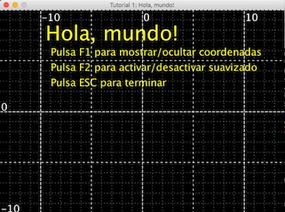

Ventanas: gestión sencilla de una interfaz de usuario gráfica en Java
=====================================================================

_Library created for my Object-Oriented Programming students. Sorry, only in Spanish._

Esta página pretende ser de utilidad para todos aquellos que se estén iniciando
en la programación en el lenguaje Java y estén aburridos de usar la insulsa
línea de comandos (System.out.println) en sus programas. Para todos ellos he 
reado una clase llamada Ventana, cuyo código puedes descargarte y usar
ibremente, que te permitirá crear ventanas donde dibujar gráficos sencillos,
escribir textos de diferentes tamaños y colores, mostrar imágenes guardadas en
archivos de disco, así como leer el estado del ratón y del teclado.

Para ver ejemplos de uso, basta con abrir el proyecto en Netbeans y ejecutar
algunos de los tutoriales que incluye.

También puedes echarle un vistazo al [javadoc de la clase Ventana](JAVADOC.md).

Para ver un ejemplo de uso más complejo, puedes echar un vistazo a estos dos videojuegos:
 
* [Marcianitos](https://github.com/mariomac/marcianitos)
* [POOcman](https://github.com/mariomac/poocman)
* [MOO Pang!](https://github.com/mariomac/MOOPang) (usando una versión antigua)

Some screenshots:

